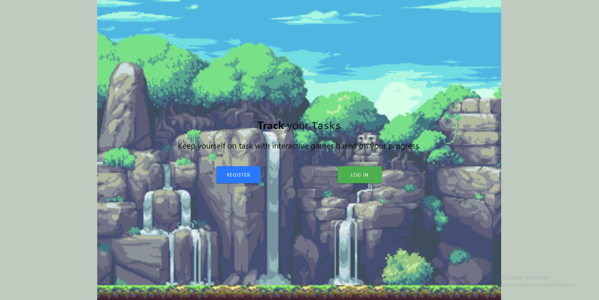
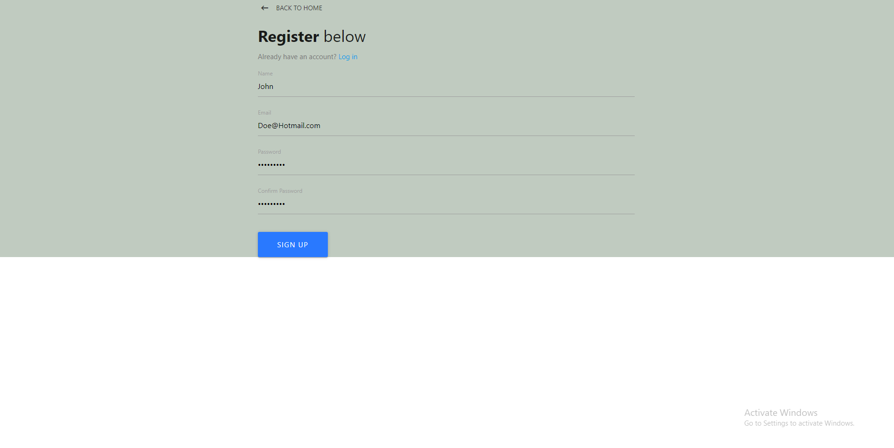
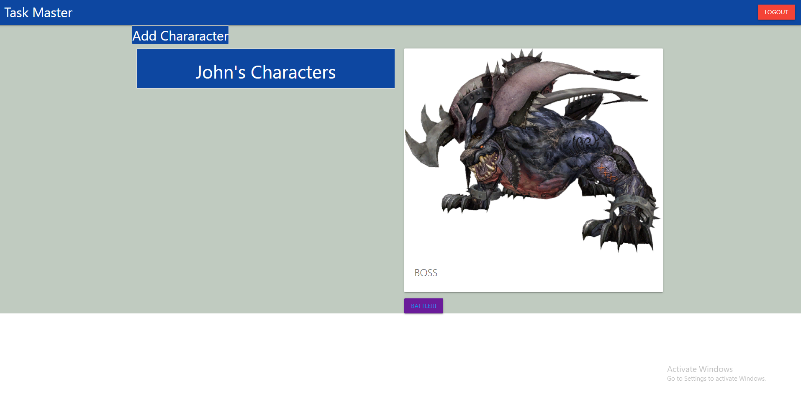
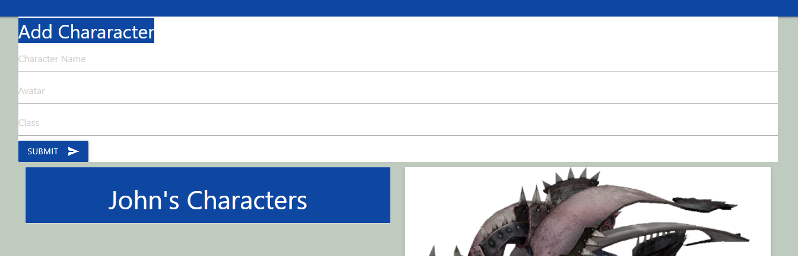
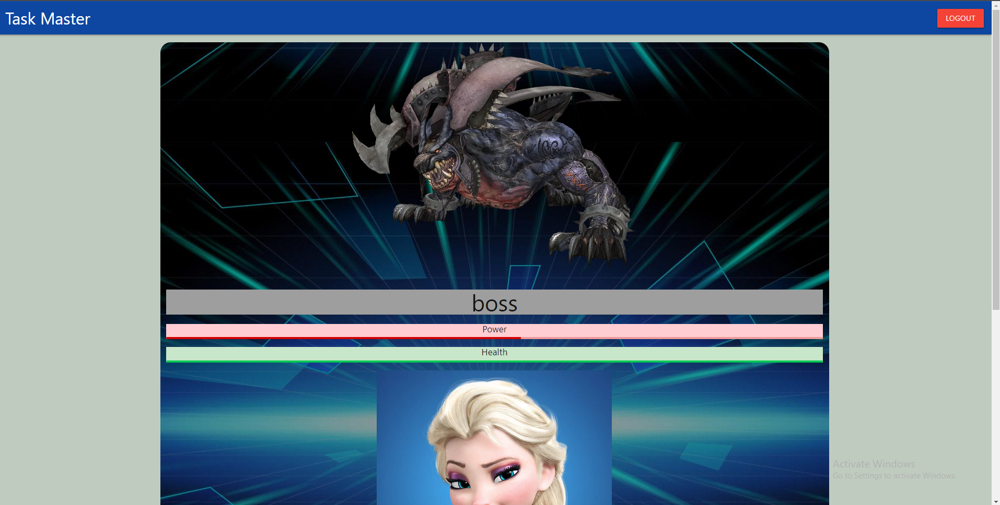

# Task-Master
This project was planned to use the MERN stack in order to track development tasks in a fun way. 
We are using mongoDB to store five different kinds of data. We are storing info on users, teams, projects specific tasks and a users player characters. Using react we have built a robust front end that is letting a user log in to our app and view character that they have created. 

# Why a task Tracker? 
Over the course of out bootcamp expiriences we decided together that we wanted to make a game in order to track progress on a project. A game that is a fun way to get rewarded for finishing tasks that can easily become mundaine and repetitive. Well there isn't a better way to make repetative tasks fun than a JRPG! The style of our game involves a boss character that would represent a board on trello, as individuals on a team moves tasks through cards they would slowly but surely weaken the boss's health. 

# Project status
This project started with us wanting to build a task tracker ourselves and evolved into us attempting to integrate the trello Api into our game. The front end and our mongo Database is set up and working. We have working react components that are making API calls whithin them selves but they are not currently integrated into our Application. 

# Screenshots 

# Project collaborators

  Julie Theriault <a href ="https://github.com/JulieT2319">Github</a> 
  Dan Degeare <a href ="https://github.com/DanDukes">Github</a> 
  Eric Wong <a href ="https://github.com/Ericcwong/">Github</a> 
  Dalton Earl <a href ="https://github.com/Dalton-Earl">Github</a> 
  Tyler Phothirath <a href ="https://github.com/tylerphopho">Github</a>

# Dependencies used

Frontend
<li>Axios</li>
<li>Classnames</li>
<li>Jwt-decode</li>
<li>Materialize-css</li>
<li>React-redux</li>
<li>react-router-dom</li>
<li>Redux</li>
<li>Redux-thunk</li>

Backend
<li>Axios</li>
<li>Bcryptjs</li>
<li>Body-parser</li>
<li>Concurrently</li>
<li>Cors</li>
<li>Dotenv</li>
<li>Express</li>
<li>If-env</li>
<li>Is-empty</li>
<li>Jsonwebtoken</li>
<li>Mongoose</li>
<li>Node-sass</li>
<li>Passport</li>
<li>Passport-jwt</li>
<li>Validator</li>

# Resources
Trello <a href = "https://developer.atlassian.com/cloud/trello/rest/">Link </a>